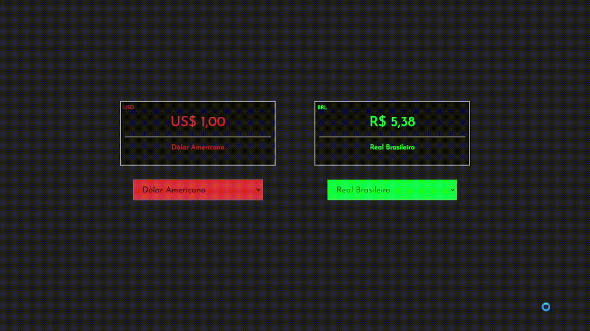

# Currency Conversor

Convert Brazilian Real to US Dollar, to Euro, to Pound and others. [Check it](https://currency-converter-git-main-gustavomont.vercel.app/)

## Technologies 🛠

- ReactJS
- Stlyed Components
- CSS
- Javascript

 

   

   

## About project 🧐

This project was made using ReactJS, styled components. My first idea was make the queries using puppeteer making a web scrpping 🤯, but it wasn't possible 😕, probably I have to study more haha. To converte the currencies I use the Currency Quote API from [Awsome API](https://docs.awesomeapi.com.br/api-de-moedas). 🧐

Sadly some conversions don't have a response 😕 but there're so many possibilities to converter. 🤓

In this project every style in component wasn't planned early, how I used to do, so some things could be better, mainly the select box. But I liked the results and I think it get some style haha.

## Check this Project

To see it working just [click here](https://currency-converter-git-main-gustavomont.vercel.app/), and if you have some advices and tips to make it better, feel free to tell me. 😁

